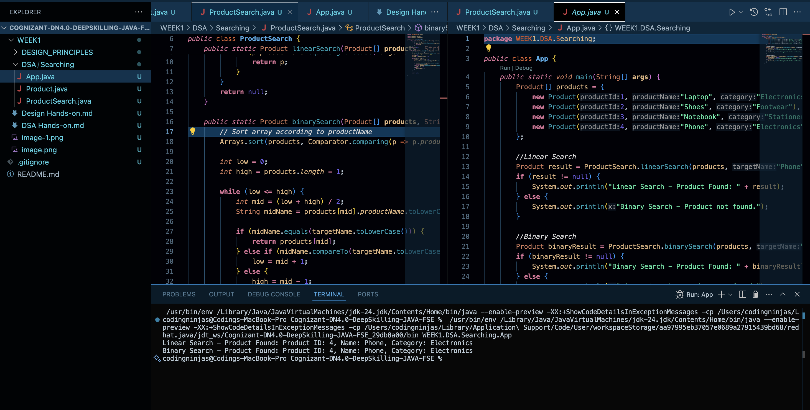
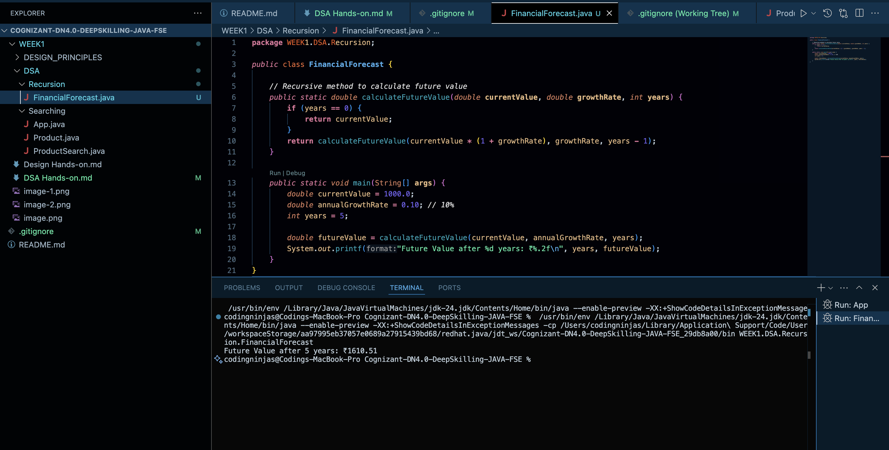

## **Exercise 2: E-commerce Platform Search Function**

**Scenario:** 

You are working on the search functionality of an e-commerce platform. The search needs to be optimized for fast performance.

**Steps:**

1. **Understand Asymptotic Notation:**

	- Explain Big O notation and how it helps in analyzing algorithms.
    - Describe the best, average, and worst-case scenarios for search operations.
    ## Understanding Asymptotic Notation

    ### What is Big O Notation?

    **Big O Notation** is a mathematical representation used to describe the time or space complexity of an algorithm in terms of input size `n`. It gives an upper bound on the time required, helping us analyze the **performance** and **scalability** of algorithms.

    > **Key Idea:** It ignores constant factors and lower-order terms, focusing only on the dominant term as input size grows large.

    ### Why Use Big O?

    - Helps in comparing different algorithms.
    - Guides in choosing the most efficient solution.
    - Predicts how the algorithm behaves with large inputs.
    - Abstracts hardware differences and focuses on algorithm efficiency.

    ---

    ### Best, Average, and Worst-Case Scenarios

    | Case Type      | Description                                                                 | Example (Linear Search)                |
    |----------------|-----------------------------------------------------------------------------|----------------------------------------|
    | **Best Case**   | The minimum time the algorithm can take, often when the desired element is at the beginning. | O(1) – Element is found at index 0     |
    | **Average Case**| Expected time considering random input distribution.                        | O(n/2) ≈ O(n) – Element somewhere in the middle |
    | **Worst Case**  | The maximum time the algorithm can take, usually when the element is not present or at the end. | O(n) – Element not found or at last index |

    For **Binary Search**, best case is `O(1)`, average and worst case are `O(log n)`.

    ---

    **Conclusion:**  
    Understanding Big O and different scenarios helps us select the most efficient search algorithm based on the dataset and use case.

2. **Setup:**

	- Create a class **Product** with attributes for searching, such as **productId, productName**, and **category**.

3. **Implementation:**
	- Implement linear search and binary search algorithms.
	- Store products in an array for linear search and a sorted array for binary search.

4. **Analysis:**
	- Compare the time complexity of linear and binary search algorithms.
	- Discuss which algorithm is more suitable for your platform and why.

    ##  Time Complexity Comparison: Linear vs Binary Search
    ### Linear Search

    - **Description:** Sequentially checks each element until the target is found or the end is reached.
    - **Time Complexity:**
    - **Best Case:** O(1) — Element is at the first index.
    - **Average Case:** O(n)
    - **Worst Case:** O(n)

    ---

    ### Binary Search

    - **Description:** Repeatedly divides a **sorted** array into halves to locate the target.
    - **Time Complexity:**
    - **Best Case:** O(1) — Element is at the middle.
    - **Average Case:** O(log n)
    - **Worst Case:** O(log n)

    ---

    ## Which Algorithm is Better for the Platform?

    | Criteria                 | Linear Search              | Binary Search               |
    |--------------------------|----------------------------|-----------------------------|
    | Works on unsorted data   |  Yes                     |  No (requires sorting)     |
    | Time-efficient           | Slow for large data     |  Fast for large data       |
    | Simplicity               |  Simple to implement     | Slightly more complex     |

    ###  Final Verdict:
    - Use **Linear Search** when:
    - The dataset is small.
    - The array is **unsorted** and performance isn’t critical.

    - Use **Binary Search** when:
    - The dataset is **large** and can be sorted.
    - Fast performance is crucial (like in e-commerce platforms).

    > 💡 **For scalable, real-world platforms like e-commerce**, binary search is preferred **after sorting** the data.


### Output


## **Exercise 7: Financial Forecasting**

**Scenario:** 

You are developing a financial forecasting tool that predicts future values based on past data.

**Steps:**

1. **Understand Recursive Algorithms:**
	- Explain the concept of recursion and how it can simplify certain problems.
    ## Understanding Recursion

    ### What is Recursion?

    Recursion is a programming technique where a method calls itself to solve a problem. The idea is to break a complex problem into smaller, more manageable sub-problems of the same type.

    A recursive function typically has two main components:
    1. **Base Case:** A condition that stops the recursion.
    2. **Recursive Case:** The function calls itself with a simpler or smaller input.

    ### How Recursion Simplifies Problems

    Recursion helps simplify problems that have a natural hierarchical or repetitive structure. Instead of writing complex loops, recursion can provide a cleaner and more intuitive solution.

    #### Examples of Problems Simplified by Recursion:
    - Calculating factorial of a number
    - Computing Fibonacci numbers
    - Traversing data structures like trees and graphs
    - Solving puzzles (e.g., Tower of Hanoi)

    ### Advantages of Recursion:
    - Reduces code complexity for certain problems
    - Makes the code more readable and elegant
    - Matches the natural definition of some problems

    ### Things to Keep in Mind:
    - Every recursive function must eventually reach the base case.
    - Recursive solutions can lead to high memory usage if not implemented carefully.
    - Some recursive problems can be optimized using techniques like **memoization** or **dynamic programming**.


2. **Setup:**
	- Create a method to calculate the future value using a recursive approach.

3. **Implementation:**
	- Implement a recursive algorithm to predict future values based on past growth rates.

4. **Analysis:**
	- Discuss the time complexity of your recursive algorithm.
	- Explain how to optimize the recursive solution to avoid excessive computation.

    Sure! Here's the explanation in structured `.md` format:

---

## Time Complexity and Optimization of Recursive Financial Forecast Algorithm

### 1. Time Complexity of Recursive Algorithm

The recursive function used to calculate future value follows a straightforward recursive pattern:

```java
return calculateFutureValue(currentValue * (1 + growthRate), growthRate, years - 1);
````

This function makes one recursive call per year until the base case (`years == 0`) is reached.

* **Time Complexity:** O(n), where `n` is the number of years.
* **Space Complexity:** O(n), due to the recursive call stack.

Each recursive call computes the value for one year, so the total number of calls is equal to the number of years.

### 2. Optimization Using Memoization

If the same function is called multiple times with the same parameters (which might happen in more complex scenarios), the algorithm can be optimized using **memoization**.

**Memoization** stores already computed results in a map or array so that future calls with the same input do not require re-computation.

Example optimization with memoization:

```java
private static Map<Integer, Double> memo = new HashMap<>();

if (memo.containsKey(years)) {
return memo.get(years);
}
```

This approach avoids repeated calculations, especially useful when:

* The recursive function is used in multiple places.
* The growth rate or starting value remains the same for many queries.
* The depth of recursion is high.

### 3. When to Use Optimization

Optimization is beneficial when:

* The recursive depth is large (e.g., 1000+ years).
* The function is called multiple times in different parts of the application.
* You want to reduce execution time for repeated inputs.

### Conclusion

While the basic recursive approach is efficient for small inputs, memoization adds robustness for larger or repeated computations, improving both performance and scalability.


### Output
