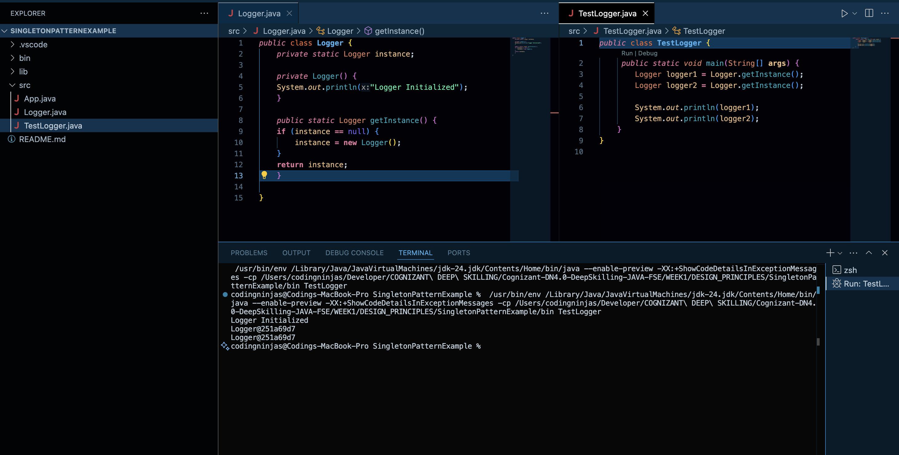
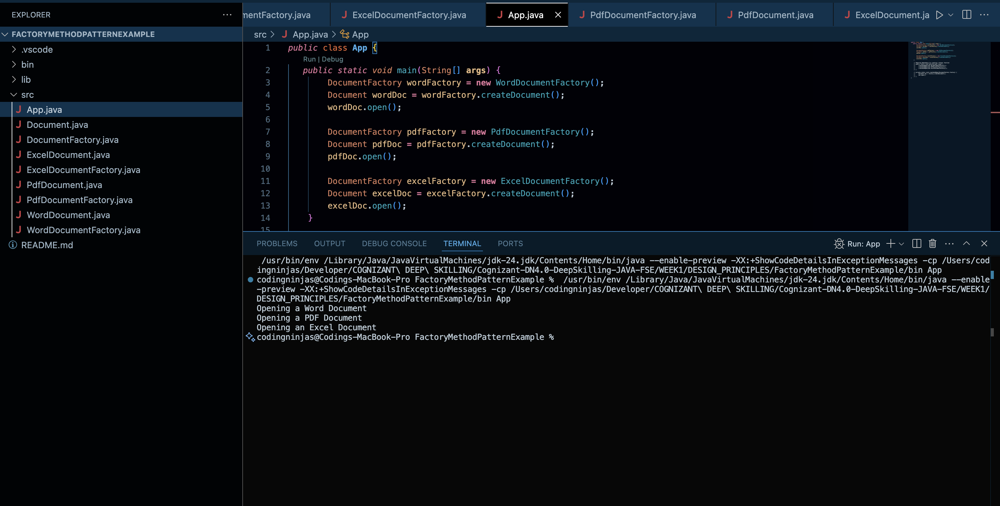

## **Exercise 1: Implementing the Singleton Pattern**

**Scenario:** 

You need to ensure that a logging utility class in your application has only one instance throughout the application lifecycle to ensure consistent logging.

**Steps:**

1. **Create a New Java Project:**
	- Create a new Java project named **SingletonPatternExample**.

2. **Define a Singleton Class:**
	- Create a class named Logger that has a private static instance of itself.
	- Ensure the constructor of Logger is private.
	- Provide a public static method to get the instance of the Logger class.

3. **Implement the Singleton Pattern:**
	- Write code to ensure that the Logger class follows the Singleton design pattern.
	
4. **Test the Singleton Implementation:**
- Create a test class to verify that only one instance of Logger is created and used across the application.

### Output

## **Exercise 2: Implementing the Factory Method Pattern**

**Scenario:** 

You are developing a document management system that needs to create different types of documents (e.g., Word, PDF, Excel). Use the Factory Method Pattern to achieve this.

**Steps:**

1. **Create a New Java Project:**
	- Create a new Java project named **FactoryMethodPatternExample**.

2. **Define Document Classes:**
	- Create interfaces or abstract classes for different document types such as **WordDocument**, **PdfDocument**, and **ExcelDocument**.

3. **Create Concrete Document Classes:**
	- Implement concrete classes for each document type that implements or extends the above interfaces or abstract classes.

4. **Implement the Factory Method:**
	- Create an abstract class **DocumentFactory** with a method **createDocument()**.
	- Create concrete factory classes for each document type that extends DocumentFactory and implements the **createDocument()** method.

5. **Test the Factory Method Implementation:**
	- Create a test class to demonstrate the creation of different document types using the factory method.

### Output
